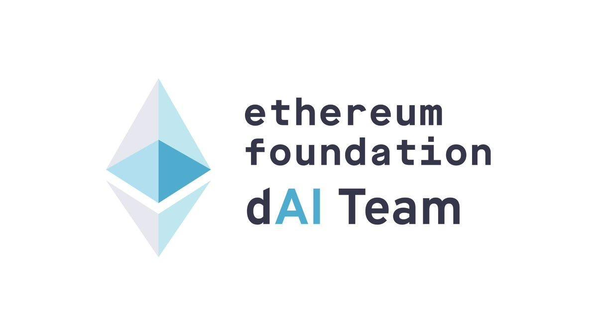

# Trustless Agents (ERC-8004) Casual Hackathon

**Decentralized and Trustless AI Agents** are reshaping the Ethereum ecosystem, with **ERC-8004** at the core.

This virtual **Casual Hackathon** runs from **Nov 2 – Nov 9**, featuring brainstorming, team matching, workshops, AMAs, an open day, and a demo day. Feel free to register in advance! Bring your ideas, code, and creativity to build the next wave of decentralized AI agents.

This is phase 2 of **“Let’s Build Trustless Agents”**, co-hosted by [LXDAO](https://x.com/LXDAO_Official) and [ETHPanda](https://x.com/ETHPanda_Org), with special support from the EF dAI team. Community -> <https://t.me/Trustless_Agents_ERC_8004_CH>

## ⏰ Program Timeline

| Event           | Time                  | Format    | Recap                |
| --------------- | --------------------- | --------- | ------------------------------ |
| **Open Day**  | Nov. 2, 5:30 PM UTC+8 | Online [Zoom Meeting Link](https://us06web.zoom.us/j/85189575712?pwd=IzSPtiydYWE2JhBBXdZJmWkGwH74wQ.1) | |
| **Workshop**  | TBD | Online | [Previous Workshop Videos](#-workshop-videos) |
| **Virtual Co-Building hours**  | Every day from 2 PM to 3 PM (UTC+8) | Online [Zoom Meeting Link](https://us06web.zoom.us/j/86925739868?pwd=R7aKJpynR7Iymgo1nHxiiPXhkRMTOA.1) | |
| **Demo Day** | Nov. 11, 13:00 PM - 15:00 PM UTC+8 | Online [Zoom Meeting Link](https://us06web.zoom.us/j/87674935176?pwd=iYXaIj6SCZFUOvpNO8KptPFCQytYaB.1) | |

## 🙋 How to operate?

## 📝 Registration

<!-- Registration link start -->
[Register ➡️](https://github.com/CasualHackathon/TrustlessAgents/issues/new?title=Registration%20-%20New&body=%23%23%20Registration%20Form%0A%0A%3E%20%F0%9F%93%9D%20**Please%20fill%20in%20the%20content%20after%20%22%3E%22**%0A%0A**Name**%20(Please%20enter%20your%20full%20name%20%7C%20Required)%0A%3E%0A%0A**Description**%20(Brief%20personal%20introduction%20including%20skills%20and%20experience%20%7C%20Required)%0A%3E%0A%0A**Contact**%20(Format%3A%20Contact%20Method%3A%20Contact%20Account%2C%20e.g.%2C%20Telegram%3A%20%40username%2C%20WeChat%3A%20username%2C%20Email%3A%20email%40example.com%20%7C%20Required)%0A%3E%0A%0A**Wallet%20Address**%20(Your%20wallet%20address%20or%20ENS%20domain%20on%20Ethereum%20mainnet)%0A%3E%0A%0A**Team%20Willingness**%20(Choose%20one%3A%20Yes%20%7C%20No%20%7C%20Maybe)%0A%3E)
<!-- Registration link end -->

- Note: Please do not modify other people's information.

<!-- Registration start -->
| Name | Description | Contact | Team Willingness | Operate |
| ---- | ----------- | ------- | ---------------- | ------- |
| [Botao Amber Hu](https://botao.hu) | CS PhD in Oxford. Previously: Researcher from Summer of Protocols (Ethereum Foundation). Research Interest: [Artificial Life](https://arxiv.org/abs/2506.04236), [Decentralized AI](https://papers.ssrn.com/sol3/papers.cfm?abstract_id=5110089) and [Trustless Autonomy](https://www.arxiv.org/abs/2505.09757). | telegram: @botaohu  email: amber@reality.design (preferred) | Yes. I am a researcher and designer with theories and insights for Trustless Agent. I am looking for an engineer to help. | [Edit](https://github.com/CasualHackathon/TrustlessAgents/issues/new?title=Registration%20-%20%5BBotao%20Amber%20Hu%5D(https%3A%2F%2Fbotao.hu)&body=%23%23%20Registration%20Form%0A%0A%3E%20%F0%9F%93%9D%20**Please%20fill%20in%20the%20content%20after%20%22%3E%22**%0A%0A**Name**%20(Please%20enter%20your%20full%20name%20%7C%20Required)%0A%3E%20%5BBotao%20Amber%20Hu%5D(https%3A%2F%2Fbotao.hu)%0A%0A**Description**%20(Brief%20personal%20introduction%20including%20skills%20and%20experience%20%7C%20Required)%0A%3E%20CS%20PhD%20in%20Oxford.%20Previously%3A%20Researcher%20from%20Summer%20of%20Protocols%20(Ethereum%20Foundation).%20Research%20Interest%3A%20%5BArtificial%20Life%5D(https%3A%2F%2Farxiv.org%2Fabs%2F2506.04236)%2C%20%5BDecentralized%20AI%5D(https%3A%2F%2Fpapers.ssrn.com%2Fsol3%2Fpapers.cfm%3Fabstract_id%3D5110089)%20and%20%5BTrustless%20Autonomy%5D(https%3A%2F%2Fwww.arxiv.org%2Fabs%2F2505.09757).%20%0A%0A**Contact**%20(Format%3A%20Contact%20Method%3A%20Contact%20Account%2C%20e.g.%2C%20Telegram%3A%20%40username%2C%20WeChat%3A%20username%2C%20Email%3A%20email%40example.com%20%7C%20Required)%0A%3E%20telegram%3A%20%40botaohu%20%20email%3A%20amber%40reality.design%20(preferred)%20%0A%0A**Wallet%20Address**%20(Your%20wallet%20address%20or%20ENS%20domain%20on%20Ethereum%20mainnet)%0A%3E%20bah.eth%0A%0A**Team%20Willingness**%20(Choose%20one%3A%20Yes%20%7C%20No%20%7C%20Maybe)%0A%3E%20Yes.%20I%20am%20a%20researcher%20and%20designer%20with%20theories%20and%20insights%20for%20Trustless%20Agent.%20I%20am%20looking%20for%20an%20engineer%20to%20help.%20) |
| 0xhardman | LXDAO Buidler, X402 application developer. | hardman_eth | Maybe | [Edit](https://github.com/CasualHackathon/TrustlessAgents/issues/new?title=Registration%20-%200xhardman&body=%23%23%20Registration%20Form%0A%0A%3E%20%F0%9F%93%9D%20**Please%20fill%20in%20the%20content%20after%20%22%3E%22**%0A%0A**Name**%20(Please%20enter%20your%20full%20name%20%7C%20Required)%0A%3E0xhardman%0A%0A**Description**%20(Brief%20personal%20introduction%20including%20skills%20and%20experience%20%7C%20Required)%0A%3E%20LXDAO%20Buidler%2C%20X402%20application%20developer.%0A%0A**Contact**%20(Format%3A%20Contact%20Method%3A%20Contact%20Account%2C%20e.g.%2C%20Telegram%3A%20%40username%2C%20WeChat%3A%20username%2C%20Email%3A%20email%40example.com%20%7C%20Required)%0A%3E%20hardman_eth%0A%0A**Wallet%20Address**%20(Your%20wallet%20address%20or%20ENS%20domain%20on%20Ethereum%20mainnet)%0A%3E%200xb15115A15d5992A756D003AE74C0b832918fAb75%0A%0A**Team%20Willingness**%20(Choose%20one%3A%20Yes%20%7C%20No%20%7C%20Maybe)%0A%3EMaybe) |
| Ahmed Makinde | I'm a javascript developer with over three years of experience. I have built multiple projects and products in the web2 and web3 space. I have won hackathons across Monad, Starknet, Solana, Zora, Vechain and built onchain AI Agents. | Telegram: @thatweb3gee | Yes | [Edit](https://github.com/CasualHackathon/TrustlessAgents/issues/new?title=Registration%20-%20Ahmed%20Makinde&body=%23%23%20Registration%20Form%0A%0A%3E%20%F0%9F%93%9D%20**Please%20fill%20in%20the%20content%20after%20%22%3E%22**%0A%0A**Name**%20(Please%20enter%20your%20full%20name%20%7C%20Required)%0A%3EAhmed%20Makinde%0A%0A**Description**%20(Brief%20personal%20introduction%20including%20skills%20and%20experience%20%7C%20Required)%0A%3EI'm%20a%20javascript%20developer%20with%20over%20three%20years%20of%20experience.%20I%20have%20built%20multiple%20projects%20and%20products%20in%20the%20web2%20and%20web3%20space.%20I%20have%20won%20hackathons%20across%20Monad%2C%20Starknet%2C%20Solana%2C%20Zora%2C%20Vechain%20and%20built%20onchain%20AI%20Agents.%20%20%0A%0A**Contact**%20(Format%3A%20Contact%20Method%3A%20Contact%20Account%2C%20e.g.%2C%20Telegram%3A%20%40username%2C%20WeChat%3A%20username%2C%20Email%3A%20email%40example.com%20%7C%20Required)%0A%3ETelegram%3A%20%40thatweb3gee%0A%0A**Wallet%20Address**%20(Your%20wallet%20address%20or%20ENS%20domain%20on%20Ethereum%20mainnet)%0A%3E0xe48a91E129f5aDAc3194c46b8dBB0Ec074E166f1%0A%0A**Team%20Willingness**%20(Choose%20one%3A%20Yes%20%7C%20No%20%7C%20Maybe)%0A%3EYes) |
| AN MUNING | Founder of Protocol Bank . Protocol Sign, Dchat.  ex Outliers fund | Email: everest9812@gmail.com WeChat: EverestAn Telegram: @: EverestAn | Yes | [Edit](https://github.com/CasualHackathon/TrustlessAgents/issues/new?title=Registration%20-%20AN%20MUNING&body=%23%23%20Registration%20Form%0A%0A%3E%20%F0%9F%93%9D%20**Please%20fill%20in%20the%20content%20after%20%22%3E%22**%0A%0A**Name**%20(Please%20enter%20your%20full%20name%20%7C%20Required)%0A%3E%20AN%20MUNING%0A%0A**Description**%20(Brief%20personal%20introduction%20including%20skills%20and%20experience%20%7C%20Required)%0A%3E%20Founder%20of%20Protocol%20Bank%20.%20Protocol%20Sign%2C%20Dchat.%20%20ex%20Outliers%20fund%0A%0A**Contact**%20(Format%3A%20Contact%20Method%3A%20Contact%20Account%2C%20e.g.%2C%20Telegram%3A%20%40username%2C%20WeChat%3A%20username%2C%20Email%3A%20email%40example.com%20%7C%20Required)%0A%3E%20Email%3A%20everest9812%40gmail.com%20WeChat%3A%20EverestAn%20Telegram%3A%20%40%3A%20EverestAn%0A%0A**Wallet%20Address**%20(Your%20wallet%20address%20or%20ENS%20domain%20on%20Ethereum%20mainnet)%0A%3E0x66794fC75C351ad9677cB00B2043868C11dfcadA%0A%0A**Team%20Willingness**%20(Choose%20one%3A%20Yes%20%7C%20No%20%7C%20Maybe)%0A%3E%20Yes) |
| Bruce Xu | Senior fullstack dev, Ethereum researcher, co-initiator of ETHpanda and LXDAO | Telegram: @brucexu_eth, Email: brucex2710@gmail.com | Maybe | [Edit](https://github.com/CasualHackathon/TrustlessAgents/issues/new?title=Registration%20-%20Bruce%20Xu&body=%23%23%20Registration%20Form%0A%0A%3E%20%F0%9F%93%9D%20**Please%20fill%20in%20the%20content%20after%20%22%3E%22**%0A%0A**Name**%20(Please%20enter%20your%20full%20name%20%7C%20Required)%0A%3E%20Bruce%20Xu%0A%0A**Description**%20(Brief%20personal%20introduction%20including%20skills%20and%20experience%20%7C%20Required)%0A%3E%20Senior%20fullstack%20dev%2C%20Ethereum%20researcher%2C%20co-initiator%20of%20ETHpanda%20and%20LXDAO%0A%0A**Contact**%20(Format%3A%20Contact%20Method%3A%20Contact%20Account%2C%20e.g.%2C%20Telegram%3A%20%40username%2C%20WeChat%3A%20username%2C%20Email%3A%20email%40example.com%20%7C%20Required)%0A%3E%20Telegram%3A%20%40brucexu_eth%2C%20Email%3A%20brucex2710%40gmail.com%0A%0A**Wallet%20Address**%20(Your%20wallet%20address%20or%20ENS%20domain%20on%20Ethereum%20mainnet)%0A%3E%200x17c57bd297175e5711ee3daf045252b588f3162f%0A%0A**Team%20Willingness**%20(Choose%20one%3A%20Yes%20%7C%20No%20%7C%20Maybe)%0A%3E%20Maybe) |
| Coooder-Crypto | LXDAO Buidler | Coooder_Crypto | Maybe | [Edit](https://github.com/CasualHackathon/TrustlessAgents/issues/new?title=Registration%20-%20Coooder-Crypto&body=%23%23%20Registration%20Form%0A%0A%3E%20%F0%9F%93%9D%20**Please%20fill%20in%20the%20content%20after%20%22%3E%22**%0A%0A**Name**%20(Please%20enter%20your%20full%20name%20%7C%20Required)%0A%3ECoooder-Crypto%0A%0A**Description**%20(Brief%20personal%20introduction%20including%20skills%20and%20experience%20%7C%20Required)%0A%3E%20LXDAO%20Buidler%0A%0A**Contact**%20(Format%3A%20Contact%20Method%3A%20Contact%20Account%2C%20e.g.%2C%20Telegram%3A%20%40username%2C%20WeChat%3A%20username%2C%20Email%3A%20email%40example.com%20%7C%20Required)%0A%3E%20Coooder_Crypto%0A%0A**Wallet%20Address**%20(Your%20wallet%20address%20or%20ENS%20domain%20on%20Ethereum%20mainnet)%0A%3E%200x702566BED3CDf6804CB807f3489DFe567a6a1CBf%0A%0A**Team%20Willingness**%20(Choose%20one%3A%20Yes%20%7C%20No%20%7C%20Maybe)%0A%3E%20Maybe) |
| Frederick | frontend | Wechat:Chocoalike | Maybe | [Edit](https://github.com/CasualHackathon/TrustlessAgents/issues/new?title=Registration%20-%20Frederick&body=%23%23%20Registration%20Form%0A%0A%3E%20%F0%9F%93%9D%20**Please%20fill%20in%20the%20content%20after%20%22%3E%22**%0A%0A**Name**%20(Please%20enter%20your%20full%20name%20%7C%20Required)%0A%3EFrederick%0A%0A**Description**%20(Brief%20personal%20introduction%20including%20skills%20and%20experience%20%7C%20Required)%0A%3Efrontend%0A%0A**Contact**%20(Format%3A%20Contact%20Method%3A%20Contact%20Account%2C%20e.g.%2C%20Telegram%3A%20%40username%2C%20WeChat%3A%20username%2C%20Email%3A%20email%40example.com%20%7C%20Required)%0A%3EWechat%3AChocoalike%0A%0A**Wallet%20Address**%20(Your%20wallet%20address%20or%20ENS%20domain%20on%20Ethereum%20mainnet)%0A%3E0x1F24412CD594C4B8C5c9beEe89a7B6F3AB8CC199%0A%0A**Team%20Willingness**%20(Choose%20one%3A%20Yes%20%7C%20No%20%7C%20Maybe)%0A%3EMaybe) |
| Hanks | Interning at an AI agent marketplace starup and very interested in ETH x AI. | Telegram: @hanksfanAI, Email: hanksfanAI@proton.me | Maybe. For specific payment scenarios related to AI agents, traditional methods are no longer applicable, so I’m exploring possible solutions and ideas. | [Edit](https://github.com/CasualHackathon/TrustlessAgents/issues/new?title=Registration%20-%20Hanks&body=%23%23%20Registration%20Form%0A%0A%3E%20%F0%9F%93%9D%20**Please%20fill%20in%20the%20content%20after%20%22%3E%22**%0A%0A**Name**%20(Please%20enter%20your%20full%20name%20%7C%20Required)%0A%3EHanks%0A%0A**Description**%20(Brief%20personal%20introduction%20including%20skills%20and%20experience%20%7C%20Required)%0A%3EInterning%20at%20an%20AI%20agent%20marketplace%20starup%20and%20very%20interested%20in%20ETH%20x%20AI.%0A%0A**Contact**%20(Format%3A%20Contact%20Method%3A%20Contact%20Account%2C%20e.g.%2C%20Telegram%3A%20%40username%2C%20WeChat%3A%20username%2C%20Email%3A%20email%40example.com%20%7C%20Required)%0A%3ETelegram%3A%20%40hanksfanAI%2C%20Email%3A%20hanksfanAI%40proton.me%0A%0A**Wallet%20Address**%20(Your%20wallet%20address%20or%20ENS%20domain%20on%20Ethereum%20mainnet)%0A%3E0xBef349027e8D47439D5408B5961e19b731FCA8Ad%0A%0A**Team%20Willingness**%20(Choose%20one%3A%20Yes%20%7C%20No%20%7C%20Maybe)%0A%3EMaybe.%20For%20specific%20payment%20scenarios%20related%20to%20AI%20agents%2C%20traditional%20methods%20are%20no%20longer%20applicable%2C%20so%20I%E2%80%99m%20exploring%20possible%20solutions%20and%20ideas.) |
| hirugohan | built web3 products in the past year. now focus on cutting-edge technology research. familiar with solidity, foundry, typescript, react, bun, and ponder | Telegram: @hirugohan | No. I am planning to work on this casual hackathon with my own casual pace. But I'm open for any collaboration out of the hackathon | [Edit](https://github.com/CasualHackathon/TrustlessAgents/issues/new?title=Registration%20-%20hirugohan&body=%23%23%20Registration%20Form%0A%0A%3E%20%F0%9F%93%9D%20**Please%20fill%20in%20the%20content%20after%20%22%3E%22**%0A%0A**Name**%20(Please%20enter%20your%20full%20name%20%7C%20Required)%0A%3E%20hirugohan%0A%0A**Description**%20(Brief%20personal%20introduction%20including%20skills%20and%20experience%20%7C%20Required)%0A%3E%20built%20web3%20products%20in%20the%20past%20year.%20now%20focus%20on%20cutting-edge%20technology%20research.%20familiar%20with%20solidity%2C%20foundry%2C%20typescript%2C%20react%2C%20bun%2C%20and%20ponder%0A%0A**Contact**%20(Format%3A%20Contact%20Method%3A%20Contact%20Account%2C%20e.g.%2C%20Telegram%3A%20%40username%2C%20WeChat%3A%20username%2C%20Email%3A%20email%40example.com%20%7C%20Required)%0A%3E%20Telegram%3A%20%40hirugohan%0A%0A**Wallet%20Address**%20(Your%20wallet%20address%20or%20ENS%20domain%20on%20Ethereum%20mainnet)%0A%3E%20hirugohan.eth%20%0A%0A**Team%20Willingness**%20(Choose%20one%3A%20Yes%20%7C%20No%20%7C%20Maybe)%0A%3E%20No.%20I%20am%20planning%20to%20work%20on%20this%20casual%20hackathon%20with%20my%20own%20casual%20pace.%20But%20I'm%20open%20for%20any%20collaboration%20out%20of%20the%20hackathon) |
| Joanne Chen | Smart contract & backend engineer with 3+ years of experience in Web3 development, familiar with Solidity, TypeScript, and Golang. | Email: joanne860422@gmail.com Telegram: @joanne_ej_chen | Yes | [Edit](https://github.com/CasualHackathon/TrustlessAgents/issues/new?title=Registration%20-%20Joanne%20Chen&body=%23%23%20Registration%20Form%0A%0A%3E%20%F0%9F%93%9D%20**Please%20fill%20in%20the%20content%20after%20%22%3E%22**%0A%0A**Name**%20%0A%3E%20Joanne%20Chen%0A%0A**Description**%20%0A%3E%20Smart%20contract%20%26%20backend%20engineer%20with%203%2B%20years%20of%20experience%20in%20Web3%20development%2C%20familiar%20with%20Solidity%2C%20TypeScript%2C%20and%20Golang.%0A%0A**Contact**%20%0A%3E%20Email%3A%20joanne860422%40gmail.com%20Telegram%3A%20%40joanne_ej_chen%0A%0A**Wallet%20Address**%20%0A%3E%200xB3731cB8D727D38Bc0523145fA58C8ad97eA9257%0A%0A**Team%20Willingness**%20(Choose%20one%3A%20Yes%20%7C%20No%20%7C%20Maybe)%0A%3E%20Yes) |
| Joy Wang | Backend engineer in industrial data platform. Exploring web3 opportunities. | Email: 727333914@qq.com WeChat: WQ-2066 Telegram: @:JoyWQQ | Yes | [Edit](https://github.com/CasualHackathon/TrustlessAgents/issues/new?title=Registration%20-%20Joy%20Wang&body=%23%23%20Registration%20Form%0A%0A%3E%20%F0%9F%93%9D%20**Please%20fill%20in%20the%20content%20after%20%22%3E%22**%0A%0A**Name**%20(Please%20enter%20your%20full%20name%20%7C%20Required)%0A%3E%20Joy%20Wang%0A%0A**Description**%20(Brief%20personal%20introduction%20including%20skills%20and%20experience%20%7C%20Required)%0A%3E%20Backend%20engineer%20in%20industrial%20data%20platform.%20Exploring%20web3%20opportunities.%0A%0A**Contact**%20(Format%3A%20Contact%20Method%3A%20Contact%20Account%2C%20e.g.%2C%20Telegram%3A%20%40username%2C%20WeChat%3A%20username%2C%20Email%3A%20email%40example.com%20%7C%20Required)%0A%3E%20Email%3A%20727333914%40qq.com%20WeChat%3A%20WQ-2066%20Telegram%3A%20%40%3AJoyWQQ%0A%0A**Wallet%20Address**%20(Your%20wallet%20address%20or%20ENS%20domain%20on%20Ethereum%20mainnet)%0A%3E0xd3066C388978d0C96372b6e85594D84cC4c37030%0A%0A**Team%20Willingness**%20(Choose%20one%3A%20Yes%20%7C%20No%20%7C%20Maybe)%0A%3E%20Yes) |
| karl4c | entry-level Dapp Developer, familiar with foundry, react, next,js | Telegram: @karl4chill , WeChat: Junghan_11 | Maybe | [Edit](https://github.com/CasualHackathon/TrustlessAgents/issues/new?title=Registration%20-%20karl4c&body=%23%23%20Registration%20Form%0A%0A%3E%20%F0%9F%93%9D%20**Please%20fill%20in%20the%20content%20after%20%22%3E%22**%0A%0A**Name**%20(Please%20enter%20your%20full%20name%20%7C%20Required)%0A%3Ekarl4c%0A%0A**Description**%20(Brief%20personal%20introduction%20including%20skills%20and%20experience%20%7C%20Required)%0A%3Eentry-level%20Dapp%20Developer%2C%20familiar%20with%20foundry%2C%20react%2C%20next%2Cjs%0A%0A**Contact**%20(Format%3A%20Contact%20Method%3A%20Contact%20Account%2C%20e.g.%2C%20Telegram%3A%20%40username%2C%20WeChat%3A%20username%2C%20Email%3A%20email%40example.com%20%7C%20Required)%0A%3ETelegram%3A%20%40karl4chill%20%2C%20WeChat%3A%20Junghan_11%0A%0A**Wallet%20Address**%20(Your%20wallet%20address%20or%20ENS%20domain%20on%20Ethereum%20mainnet)%0A%3Ekarl4c.eth%0A%0A**Team%20Willingness**%20(Choose%20one%3A%20Yes%20%7C%20No%20%7C%20Maybe)%0A%3EMaybe) |
| Keylen | LXDAO builder | tg:Keylen3_14 | Maybe | [Edit](https://github.com/CasualHackathon/TrustlessAgents/issues/new?title=Registration%20-%20Keylen&body=%23%23%20Registration%20Form%0A%0A%3E%20%F0%9F%93%9D%20**Please%20fill%20in%20the%20content%20after%20%22%3E%22**%0A%0A**Name**%20(Please%20enter%20your%20full%20name%20%7C%20Required)%0A%3EKeylen%0A%0A**Description**%20(Brief%20personal%20introduction%20including%20skills%20and%20experience%20%7C%20Required)%0A%3ELXDAO%20builder%0A%0A**Contact**%20(Format%3A%20Contact%20Method%3A%20Contact%20Account%2C%20e.g.%2C%20Telegram%3A%20%40username%2C%20WeChat%3A%20username%2C%20Email%3A%20email%40example.com%20%7C%20Required)%0A%3Etg%3AKeylen3_14%0A%0A**Wallet%20Address**%20(Your%20wallet%20address%20or%20ENS%20domain%20on%20Ethereum%20mainnet)%0A%3E0x2627b9f8f75dbc2870232715520ffaa24248bc76%0A%0A**Team%20Willingness**%20(Choose%20one%3A%20Yes%20%7C%20No%20%7C%20Maybe)%0A%3EMaybe) |
| Kogoro Kudo | Smart contract developer with experience building DeFi apps | Telegram:  @mouri4599 | No | [Edit](https://github.com/CasualHackathon/TrustlessAgents/issues/new?title=Registration%20-%20Kogoro%20Kudo&body=%23%23%20Registration%20Form%0A%0A%3E%20%F0%9F%93%9D%20**Please%20fill%20in%20the%20content%20after%20%22%3E%22**%0A%0A**Name**%20(Please%20enter%20your%20full%20name%20%7C%20Required)%0A%3E%20Kogoro%20Kudo%0A%0A**Description**%20(Brief%20personal%20introduction%20including%20skills%20and%20experience%20%7C%20Required)%0A%3E%20Smart%20contract%20developer%20with%20experience%20building%20DeFi%20apps%0A%0A**Contact**%20(Format%3A%20Contact%20Method%3A%20Contact%20Account%2C%20e.g.%2C%20Telegram%3A%20%40username%2C%20WeChat%3A%20username%2C%20Email%3A%20email%40example.com%20%7C%20Required)%0A%3E%20Telegram%3A%20%20%40mouri4599%0A%0A**Wallet%20Address**%20(Your%20wallet%20address%20or%20ENS%20domain%20on%20Ethereum%20mainnet)%0A%3E%200x18dBCE2a3A9c15c508C7dE589b8CD15493919B96%0A%0A**Team%20Willingness**%20(Choose%20one%3A%20Yes%20%7C%20No%20%7C%20Maybe)%0A%3E%20No) |
| Luke | phd student, intrested in blockchain and defi data | jhuaiyu3@gmail.com | Maybe | [Edit](https://github.com/CasualHackathon/TrustlessAgents/issues/new?title=Registration%20-%20Luke&body=%23%23%20Registration%20Form%0A%0A%3E%20%F0%9F%93%9D%20**Please%20fill%20in%20the%20content%20after%20%22%3E%22**%0A%0A**Name**%20(Please%20enter%20your%20full%20name%20%7C%20Required)%0A%3ELuke%0A%0A**Description**%20(Brief%20personal%20introduction%20including%20skills%20and%20experience%20%7C%20Required)%0A%3Ephd%20student%2C%20intrested%20in%20blockchain%20and%20defi%20data%0A%0A**Contact**%20(Format%3A%20Contact%20Method%3A%20Contact%20Account%2C%20e.g.%2C%20Telegram%3A%20%40username%2C%20WeChat%3A%20username%2C%20Email%3A%20email%40example.com%20%7C%20Required)%0A%3Ejhuaiyu3%40gmail.com%0A%0A**Wallet%20Address**%20(Your%20wallet%20address%20or%20ENS%20domain%20on%20Ethereum%20mainnet)%0A%3E0x43587B0F79fc341B62FaA73c5533A6Ea6dE0EF8B%0A%0A**Team%20Willingness**%20(Choose%20one%3A%20Yes%20%7C%20No%20%7C%20Maybe)%0A%3EMaybe) |
| Micheal Zhu | 10 years backend, 3 years Web3 development experience. Proficient in Python, TypeScript, Golang, distributed architecture, and microservices. | email: michael@hubble.xyz, wechat: gowinder, Telegram: @MichaelHubble | No | [Edit](https://github.com/CasualHackathon/TrustlessAgents/issues/new?title=Registration%20-%20Micheal%20Zhu&body=%23%23%20Registration%20Form%0A%0A%3E%20%F0%9F%93%9D%20**Please%20fill%20in%20the%20content%20after%20%22%3E%22**%0A%0A**Name**%20(Please%20enter%20your%20full%20name%20%7C%20Required)%0A%3E%20Micheal%20Zhu%0A%0A**Description**%20(Brief%20personal%20introduction%20including%20skills%20and%20experience%20%7C%20Required)%0A%3E%2010%20years%20backend%2C%203%20years%20Web3%20development%20experience.%20Proficient%20in%20Python%2C%20TypeScript%2C%20Golang%2C%20distributed%20architecture%2C%20and%20microservices.%0A%0A**Contact**%20(Format%3A%20Contact%20Method%3A%20Contact%20Account%2C%20e.g.%2C%20Telegram%3A%20%40username%2C%20WeChat%3A%20username%2C%20Email%3A%20email%40example.com%20%7C%20Required)%0A%3E%20email%3A%20michael%40hubble.xyz%2C%20wechat%3A%20gowinder%2C%20Telegram%3A%20%40MichaelHubble%0A%0A**Wallet%20Address**%20(Your%20wallet%20address%20or%20ENS%20domain%20on%20Ethereum%20mainnet)%0A%3E%200xf527d7db0196e39daaff79d6a6b79214f7220fa6%0A%0A**Team%20Willingness**%20(Choose%20one%3A%20Yes%20%7C%20No%20%7C%20Maybe)%0A%3E%20No) |
| Neo Sun | 10y+ blockchain and cryptography developer. Good at Rust, Python, Solidity, Flutter and so on. More view [neosun.me](https://neosun.me) | GitHub / Telegram / WeChat / X: @sunhuachuang, Email: hi@neosun.me | Maybe | [Edit](https://github.com/CasualHackathon/TrustlessAgents/issues/new?title=Registration%20-%20Neo%20Sun&body=%23%23%20Registration%20Form%0A%0A%3E%20%F0%9F%93%9D%20**Please%20fill%20in%20the%20content%20after%20%22%3E%22**%0A%0A**Name**%20(Please%20enter%20your%20full%20name%20%7C%20Required)%0A%3E%20Neo%20Sun%0A%0A**Description**%20(Brief%20personal%20introduction%20including%20skills%20and%20experience%20%7C%20Required)%0A%3E%2010y%2B%20blockchain%20and%20cryptography%20developer.%20Good%20at%20Rust%2C%20Python%2C%20Solidity%2C%20Flutter%20and%20so%20on.%20More%20view%20%5Bneosun.me%5D(https%3A%2F%2Fneosun.me)%0A%0A**Contact**%20(Format%3A%20Contact%20Method%3A%20Contact%20Account%2C%20e.g.%2C%20Telegram%3A%20%40username%2C%20WeChat%3A%20username%2C%20Email%3A%20email%40example.com%20%7C%20Required)%0A%3E%20GitHub%20%2F%20Telegram%20%2F%20WeChat%20%2F%20X%3A%20%40sunhuachuang%2C%20Email%3A%20hi%40neosun.me%0A%0A**Wallet%20Address**%20(Your%20wallet%20address%20or%20ENS%20domain%20on%20Ethereum%20mainnet)%0A%3E%20%20cymple.eth%0A%0A**Team%20Willingness**%20(Choose%20one%3A%20Yes%20%7C%20No%20%7C%20Maybe)%0A%3E%20Maybe) |
| Root | Data Engineer focused on on-chain data, The Graph, dashboards, and protocol analytics. Love collaborating and shipping cool stuff. | telegram: @Abthelhak, x: @Abthelhaks | Yes | [Edit](https://github.com/CasualHackathon/TrustlessAgents/issues/new?title=Registration%20-%20Root&body=**Name**%20%20%0ARoot%0A%0A**Description**%20%20%0AData%20Engineer%20focused%20on%20on-chain%20data%2C%20The%20Graph%2C%20dashboards%2C%20and%20protocol%20analytics.%20Love%20collaborating%20and%20shipping%20cool%20stuff.%0A%0A**Contact**%20%20%0Atelegram%3A%20%40Abthelhak%2C%20x%3A%20%40Abthelhaks%0A%0A**Wallet%20Address**%20%20%0A%3CYOUR_WALLET_OR_ENS_HERE%3E%0A%0A**Team%20Willingness**%20%20%0AYes) |
| Sacultor | just a cool guy(frontend...) | WeChat：XXZERO2036 | Maybe | [Edit](https://github.com/CasualHackathon/TrustlessAgents/issues/new?title=Registration%20-%20Sacultor&body=%23%23%20Registration%20Form%0A%0A%3E%20%F0%9F%93%9D%20**Please%20fill%20in%20the%20content%20after%20%22%3E%22**%0A%0A**Name**%20(Please%20enter%20your%20full%20name%20%7C%20Required)%0A%3ESacultor%0A%0A**Description**%20(Brief%20personal%20introduction%20including%20skills%20and%20experience%20%7C%20Required)%0A%3Ejust%20a%20cool%20guy(frontend...)%0A%0A**Contact**%20(Format%3A%20Contact%20Method%3A%20Contact%20Account%2C%20e.g.%2C%20Telegram%3A%20%40username%2C%20WeChat%3A%20username%2C%20Email%3A%20email%40example.com%20%7C%20Required)%0A%3EWeChat%EF%BC%9AXXZERO2036%0A**Wallet%20Address**%20(Your%20wallet%20address%20or%20ENS%20domain%20on%20Ethereum%20mainnet)%0A%3E0xDda56dc03Ca7100615683aa1981854Da0dCA6b66%0A%0A**Team%20Willingness**%20(Choose%20one%3A%20Yes%20%7C%20No%20%7C%20Maybe)%0A%3EMaybe) |
| Shawn | have a basic understanding of AI application and Ethereum | Wechat：mitshon | maybe | [Edit](https://github.com/CasualHackathon/TrustlessAgents/issues/new?title=Registration%20-%20Shawn&body=%23%23%20Registration%20Form%0A%0A%3E%20%F0%9F%93%9D%20**Please%20fill%20in%20the%20content%20after%20%22%3E%22**%0A%0A**Name**%20(Please%20enter%20your%20full%20name%20%7C%20Required)%0A%3EShawn%0A%0A**Description**%20(Brief%20personal%20introduction%20including%20skills%20and%20experience%20%7C%20Required)%0A%3Ehave%20a%20basic%20understanding%20of%20AI%20application%20and%20Ethereum%0A%0A**Contact**%20(Format%3A%20Contact%20Method%3A%20Contact%20Account%2C%20e.g.%2C%20Telegram%3A%20%40username%2C%20WeChat%3A%20username%2C%20Email%3A%20email%40example.com%20%7C%20Required)%0A%3EWechat%EF%BC%9Amitshon%0A%0A**Wallet%20Address**%20(Your%20wallet%20address%20or%20ENS%20domain%20on%20Ethereum%20mainnet)%0A%3Enot%20yet%0A%0A**Team%20Willingness**%20(Choose%20one%3A%20Yes%20%7C%20No%20%7C%20Maybe)%0A%3Emaybe) |
| Swift Evo | DeSci and public good funding focus, little AI and coding experience. Eng and Cantonese and Mandarin fluently | TG, @swiftevo, | yes | [Edit](https://github.com/CasualHackathon/TrustlessAgents/issues/new?title=Registration%20-%20Swift%20Evo&body=%23%23%20Registration%20Form%0A%0A%3E%20%F0%9F%93%9D%20**Please%20fill%20in%20the%20content%20after%20%22%3E%22**%0A%0A**Name**%20(Please%20enter%20your%20full%20name%20%7C%20Required)%0A%3E%20Swift%20Evo%0A%0A**Description**%20(Brief%20personal%20introduction%20including%20skills%20and%20experience%20%7C%20Required)%0A%3E%20DeSci%20and%20public%20good%20funding%20focus%2C%20little%20AI%20and%20coding%20experience.%20Eng%20and%20Cantonese%20and%20Mandarin%20fluently%20%0A%0A**Contact**%20(Format%3A%20Contact%20Method%3A%20Contact%20Account%2C%20e.g.%2C%20Telegram%3A%20%40username%2C%20WeChat%3A%20username%2C%20Email%3A%20email%40example.com%20%7C%20Required)%0A%3E%20TG%2C%20%40swiftevo%2C%20%0AEmail%3A%20swiftevomatters%40gmail.com%20%0A%0A**Wallet%20Address**%20(Your%20wallet%20address%20or%20ENS%20domain%20on%20Ethereum%20mainnet)%0A%3Eswiftevo.eth%0A%0A**Team%20Willingness**%20(Choose%20one%3A%20Yes%20%7C%20No%20%7C%20Maybe)%0A%3Eyes) |
| Ultra | Decades of Coding, Cloud and DevOps experience, crypto miner since 2017, professional validator on 55+ blockchains since 2021. Agentic research and development. | Telegram: @zeroxultravioleta | Maybe | [Edit](https://github.com/CasualHackathon/TrustlessAgents/issues/new?title=Registration%20-%20Ultra&body=%23%23%20Registration%20Form%0A%0A%3E%20%F0%9F%93%9D%20**Please%20fill%20in%20the%20content%20after%20%22%3E%22**%0A%0A**Name**%20(Please%20enter%20your%20full%20name%20%7C%20Required)%0A%3E%20Ultra%0A%0A**Description**%20(Brief%20personal%20introduction%20including%20skills%20and%20experience%20%7C%20Required)%0A%3E%20Decades%20of%20Coding%2C%20Cloud%20and%20DevOps%20experience%2C%20crypto%20miner%20since%202017%2C%20professional%20validator%20on%2055%2B%20blockchains%20since%202021.%20Agentic%20research%20and%20development.%20%0A%0A**Contact**%20(Format%3A%20Contact%20Method%3A%20Contact%20Account%2C%20e.g.%2C%20Telegram%3A%20%40username%2C%20WeChat%3A%20username%2C%20Email%3A%20email%40example.com%20%7C%20Required)%0A%3E%20Telegram%3A%20%40zeroxultravioleta%0A%0A**Wallet%20Address**%20(Your%20wallet%20address%20or%20ENS%20domain%20on%20Ethereum%20mainnet)%0A%3E%200xultravioleta.eth%0A%0A**Team%20Willingness**%20(Choose%20one%3A%20Yes%20%7C%20No%20%7C%20Maybe)%0A%3E%20Maybe) |
| xfajarr | A web3 developer who focuses on smart contracts, currently building on EVM and Sui. | Telegram: @xfajarrr | Maybe | [Edit](https://github.com/CasualHackathon/TrustlessAgents/issues/new?title=Registration%20-%20xfajarr&body=%23%23%20Registration%20Form%0A%0A%3E%20%F0%9F%93%9D%20**Please%20fill%20in%20the%20content%20after%20%22%3E%22**%0A%0A**Name**%20(Please%20enter%20your%20full%20name%20%7C%20Required)%0A%3E%20xfajarr%0A%0A**Description**%20(Brief%20personal%20introduction%20including%20skills%20and%20experience%20%7C%20Required)%0A%3E%20A%20web3%20developer%20who%20focuses%20on%20smart%20contracts%2C%20currently%20building%20on%20EVM%20and%20Sui.%0A%0A**Contact**%20(Format%3A%20Contact%20Method%3A%20Contact%20Account%2C%20e.g.%2C%20Telegram%3A%20%40username%2C%20WeChat%3A%20username%2C%20Email%3A%20email%40example.com%20%7C%20Required)%0A%3E%20Telegram%3A%20%40xfajarrr%0A%0A**Wallet%20Address**%20(Your%20wallet%20address%20or%20ENS%20domain%20on%20Ethereum%20mainnet)%0A%3E%20xfajarr.eth%0A%0A**Team%20Willingness**%20(Choose%20one%3A%20Yes%20%7C%20No%20%7C%20Maybe)%0A%3E%20Maybe) |
| Z Tensoon | Java backend developer with 3+ years of experience, interested in DeFi and ZK tech, and familiar with Solidity and Hardhat. | Telegram: @ztensoon, WeChat: ChuanYeyeye666 | Maybe, a PM or frontend needed. | [Edit](https://github.com/CasualHackathon/TrustlessAgents/issues/new?title=Registration%20-%20Z%20Tensoon&body=%23%23%20Registration%20Form%0A%0A%3E%20%F0%9F%93%9D%20**Please%20fill%20in%20the%20content%20after%20%22%3E%22**%0A%0A**Name**%20(Please%20enter%20your%20full%20name%20%7C%20Required)%0A%3EZ%20Tensoon%0A%0A**Description**%20(Brief%20personal%20introduction%20including%20skills%20and%20experience%20%7C%20Required)%0A%3EJava%20backend%20developer%20with%203%2B%20years%20of%20experience%2C%20interested%20in%20DeFi%20and%20ZK%20tech%2C%20and%20familiar%20with%20Solidity%20and%20Hardhat.%0A%0A**Contact**%20(Format%3A%20Contact%20Method%3A%20Contact%20Account%2C%20e.g.%2C%20Telegram%3A%20%40username%2C%20WeChat%3A%20username%2C%20Email%3A%20email%40example.com%20%7C%20Required)%0A%3ETelegram%3A%20%40ztensoon%2C%20WeChat%3A%20ChuanYeyeye666%0A%0A**Wallet%20Address**%20(Your%20wallet%20address%20or%20ENS%20domain%20on%20Ethereum%20mainnet)%0A%3E0xbF23703E5598A1f6f3725680f15215d08C80fCDf%0A%0A**Team%20Willingness**%20(Choose%20one%3A%20Yes%20%7C%20No%20%7C%20Maybe)%0A%3EMaybe%2C%20a%20PM%20or%20frontend%20needed.) |

<!-- Registration end -->

## 🎯 Submission

<!-- Submission link start -->

[Submit ➡️](https://github.com/CasualHackathon/TrustlessAgents/issues/new?title=Submission%20-%20New&body=%23%23%20Project%20Submission%20Form%0A%0A%3E%20%F0%9F%93%9D%20**Please%20fill%20in%20the%20content%20after%20%22%3E%22**%0A%0A**Project%20Name**%20(Enter%20your%20project%20name%20%7C%20Required)%0A%3E%0A%0A**Project%20Description**%20(Brief%20description%20about%20your%20project%20in%20one%20sentence%20%7C%20Required)%0A%3E%0A%0A**Repository%20URL**%20(Open%20source%20repository%20URL%20-%20project%20must%20be%20open%20source)%0A%3E%0A%0A**Project%20Leader**%20(Project%20leader%20name%20%7C%20Required)%0A%3E%0A%0A**Project%20Members**%20(List%20all%20team%20members%2C%20comma-separated)%0A%3E%0A%0A**Team%20Members%20Wallet**%20(List%20all%20team%20members%20wallet%2C%20comma-separated%20e.g.%2C%20Alice%3A0x12345...%20%2C%20Bob%3A0x12345...)%0A%3E)

<!-- Submission link end -->

- Complete registration before submitting.
- Note: Please do not modify other people's information.

<!-- Submission start -->
| Project | Description | Members | Leader | Repository | Operate |
| ----------- | ----------------- | -------------- | ------- | ---------- | -------- |
| 3 stage of ERC-8004 raters | I aim to solve the problem - why / how human / AI rater will give the true score to the Agent. | [Swift Evo](https://github.com/Swiftevo) | [Swift Evo](https://github.com/Swiftevo) | [🔗](https://github.com/Swiftevo/3-stage-of-ERC-8004-raters/tree/main) | [Edit](https://github.com/CasualHackathon/TrustlessAgents/issues/new?title=Submission%20-%203%20stage%20of%20ERC-8004%20raters&body=%23%23%20Project%20Submission%20Form%0A%0A%3E%20%F0%9F%93%9D%20**Please%20fill%20in%20the%20content%20after%20%22%3E%22**%0A%0A**Project%20Name**%20(Enter%20your%20project%20name%20%7C%20Required)%0A%3E3%20stage%20of%20ERC-8004%20raters%20%0A%0A**Project%20Description**%20(Brief%20description%20about%20your%20project%20in%20one%20sentence%20%7C%20Required)%0A%3EI%20aim%20to%20solve%20the%20problem%20-%20why%20%2F%20how%20human%20%2F%20AI%20rater%20will%20give%20the%20true%20score%20to%20the%20Agent.%20%0A%0A**Repository%20URL**%20(Open%20source%20repository%20URL%20-%20project%20must%20be%20open%20source)%0A%3Ehttps%3A%2F%2Fgithub.com%2FSwiftevo%2F3-stage-of-ERC-8004-raters%2Ftree%2Fmain%0A%0A**Project%20Leader**%20(Project%20leader%20name%20%7C%20Required)%0A%3E%5BSwift%20Evo%5D(https%3A%2F%2Fgithub.com%2FSwiftevo)%0A%0A**Project%20Members**%20(List%20all%20team%20members%2C%20comma-separated)%0A%3E%5BSwift%20Evo%5D(https%3A%2F%2Fgithub.com%2FSwiftevo)%0A%0A**Team%20Members%20Wallet**%20(List%20all%20team%20members%20wallet%2C%20comma-separated%20e.g.%2C%20Alice%3A0x12345...%20%2C%20Bob%3A0x12345...)%0A%3E0xB2206f941A5206B55BFA33E665687523A8bcEd80) |
| Dolly X402 SDK | An AI-powered community moderator with X402 payment integration on Base L2, providing 24/7 multilingual support, knowledge-based answers, and on-chain data queries with USDC micropayments. | 0xhardman | 0xhardman | [🔗](https://github.com/ContriXLimited/x402-dolly) | [Edit](https://github.com/CasualHackathon/TrustlessAgents/issues/new?title=Submission%20-%20Dolly%20X402%20SDK&body=%23%23%20Project%20Submission%20Form%0A%0A%3E%20%F0%9F%93%9D%20**Please%20fill%20in%20the%20content%20after%20%22%3E%22**%0A%0A**Project%20Name**%20(Enter%20your%20project%20name%20%7C%20Required)%0A%3E%20%20Dolly%20X402%20SDK%0A%0A**Project%20Description**%20(Brief%20description%20about%20your%20project%20in%20one%20sentence%20%7C%20Required)%0A%3E%20An%20AI-powered%20community%20moderator%20with%20X402%20payment%20integration%20on%20Base%20L2%2C%20providing%2024%2F7%20multilingual%20support%2C%20knowledge-based%20answers%2C%20and%20on-chain%20data%20queries%20with%20USDC%20micropayments.%0A%0A**Repository%20URL**%20(Open%20source%20repository%20URL%20-%20project%20must%20be%20open%20source)%0A%3E%20https%3A%2F%2Fgithub.com%2FContriXLimited%2Fx402-dolly%0A%0A**Project%20Leader**%20(Project%20leader%20name%20%7C%20Required)%0A%3E%200xhardman%0A%0A**Project%20Members**%20(List%20all%20team%20members%2C%20comma-separated)%0A%3E%200xhardman%0A%0A**Team%20Members%20Wallet**%20(List%20all%20team%20members%20wallet%2C%20comma-separated%20e.g.%2C%20Alice%3A0x12345...%20%2C%20Bob%3A0x12345...)%0A%3E%200xb15115A15d5992A756D003AE74C0b832918fAb75) |
| Hubble AI | Hubble AI turns data into tradeable insights on Agent Markplace - powered by ERC-8004 and x402. | Leon, Michael, Amy, Melody, Medy, Ada, Nian, Shook | Leon, Michael （项目注册人） | [🔗](backend: https://github.com/HubbleVision/hubble-erc8004-market-api-server) | [Edit](https://github.com/CasualHackathon/TrustlessAgents/issues/new?title=Submission%20-%20Hubble%20AI&body=%23%23%20Project%20Submission%20Form%0A%0A%3E%20%F0%9F%93%9D%20**Please%20fill%20in%20the%20content%20after%20%22%3E%22**%0A%0A**Project%20Name**%20(Enter%20your%20project%20name%20%7C%20Required)%0A%3E%20Hubble%20AI%0A%0A**Project%20Description**%20(Brief%20description%20about%20your%20project%20in%20one%20sentence%20%7C%20Required)%0A%3E%20Hubble%20AI%20turns%20data%20into%20tradeable%20insights%20on%20Agent%20Markplace%20-%20powered%20by%20ERC-8004%20and%20x402.%0A%0A**Project%20Leader**%20(Project%20leader%20name%20%7C%20Required)%0A%3E%20Leon%2C%20Michael%20%EF%BC%88%E9%A1%B9%E7%9B%AE%E6%B3%A8%E5%86%8C%E4%BA%BA%EF%BC%89%0A%0A**Project%20Members**%20(List%20all%20team%20members%2C%20comma-separated)%0A%3E%20Leon%2C%20Michael%2C%20Amy%2C%20Melody%2C%20Medy%2C%20Ada%2C%20Nian%2C%20Shook%0A%0A**Repository%20URL**%20(Open%20source%20repository%20URL%20-%20project%20must%20be%20open%20source)%0A%3E%20backend%3A%20https%3A%2F%2Fgithub.com%2FHubbleVision%2Fhubble-erc8004-market-api-server%0Afrontend%3A%20https%3A%2F%2Fgithub.com%2FHubbleVision%2Fmarketplace-frontend%0A%0A**Team%20Members%20Wallet**%20(List%20all%20team%20members%20wallet%2C%20comma-separated%20e.g.%2C%20Alice%3A0x12345...%20%2C%20Bob%3A0x12345...)%0A%3E%20Michael%3A%200x5ef14a0611112bced1c9df8e9bdfa7eb8f63e079%0AAmy%3A%200x5b9a92fc1df59299e6a3e6d1cacbb5e7c36319da) |
| Machine Mom | Machine Mom is a commons-based AI companion intentionally designed as a maternal caregiver for long-term human flourishing and eudaimonia rather than per-turn appeasement. Machine Mom operates as a self-sovereign intelligent commons that preserves private conversations for each user without private-sector control, solving the "tragedy of machine love". | Bruce Xu | Botao `Amber' Hu | [🔗](https://github.com/realitydeslab/mach-mom) | [Edit](https://github.com/CasualHackathon/TrustlessAgents/issues/new?title=Submission%20-%20Machine%20Mom&body=%23%23%20Project%20Submission%20Form%0A%0A%3E%20%F0%9F%93%9D%20**Please%20fill%20in%20the%20content%20after%20%22%3E%22**%0A%0A**Project%20Name**%20(Enter%20your%20project%20name%20%7C%20Required)%0A%3E%20Machine%20Mom%0A%0A**Project%20Description**%20(Brief%20description%20about%20your%20project%20in%20one%20sentence%20%7C%20Required)%0A%3E%20Machine%20Mom%20is%20a%20commons-based%20AI%20companion%20intentionally%20designed%20as%20a%20maternal%20caregiver%20for%20long-term%20human%20flourishing%20and%20eudaimonia%20rather%20than%20per-turn%20appeasement.%20Machine%20Mom%20operates%20as%20a%20self-sovereign%20intelligent%20commons%20that%20preserves%20private%20conversations%20for%20each%20user%20without%20private-sector%20control%2C%20solving%20the%20%22tragedy%20of%20machine%20love%22.%0A%0A**Repository%20URL**%20(Open%20source%20repository%20URL%20-%20project%20must%20be%20open%20source)%0A%3E%20https%3A%2F%2Fgithub.com%2Frealitydeslab%2Fmach-mom%0A%0A**Project%20Leader**%20(Project%20leader%20name%20%7C%20Required)%0A%3E%20Botao%20%60Amber'%20Hu%0A%0A**Project%20Members**%20(List%20all%20team%20members%2C%20comma-separated)%0A%3E%20Bruce%20Xu%0A%0A**Team%20Members%20Wallet**%20(List%20all%20team%20members%20wallet%2C%20comma-separated%20e.g.%2C%20Alice%3A0x12345...%20%2C%20Bob%3A0x12345...)%0A%3E%20realitydeslab.eth%20) |
| Streaming payments for the trustless agent economy | Exploring continuous, trustless payments for AI agents using the x402 protocol and ERC-8004 event models. | Hanks | Hanks | [🔗](https://github.com/hanksfanAI/Streaming-payments-for-the-trustless-agent-economy) | [Edit](https://github.com/CasualHackathon/TrustlessAgents/issues/new?title=Submission%20-%20Streaming%20payments%20for%20the%20trustless%20agent%20economy&body=%23%23%20Project%20Submission%20Form%0A%0A%3E%20%F0%9F%93%9D%20**Please%20fill%20in%20the%20content%20after%20%22%3E%22**%0A%0A**Project%20Name**%20(Enter%20your%20project%20name%20%7C%20Required)%0A%3EStreaming%20payments%20for%20the%20trustless%20agent%20economy%0A%0A**Project%20Description**%20(Brief%20description%20about%20your%20project%20in%20one%20sentence%20%7C%20Required)%0A%3EExploring%20continuous%2C%20trustless%20payments%20for%20AI%20agents%20using%20the%20x402%20protocol%20and%20ERC-8004%20event%20models.%0A%0A**Repository%20URL**%20(Open%20source%20repository%20URL%20-%20project%20must%20be%20open%20source)%0A%3Ehttps%3A%2F%2Fgithub.com%2FhanksfanAI%2FStreaming-payments-for-the-trustless-agent-economy%0A%0A**Project%20Leader**%20(Project%20leader%20name%20%7C%20Required)%0A%3EHanks%0A%0A**Project%20Members**%20(List%20all%20team%20members%2C%20comma-separated)%0A%3EHanks%0A%0A**Team%20Members%20Wallet**%20(List%20all%20team%20members%20wallet%2C%20comma-separated%20e.g.%2C%20Alice%3A0x12345...%20%2C%20Bob%3A0x12345...)%0A%3EHanks%3A%200xBef349027e8D47439D5408B5961e19b731FCA8Ad) |
| synapse-insure | Automated insurance platform for AI agents featuring reputation-based pricing, NLI claim verification, and instant payout processing(No matchmaking currently) | Joy Wang | Joy Wang | [🔗](https://github.com/JoyWQ/synapse-insure.git) | [Edit](https://github.com/CasualHackathon/TrustlessAgents/issues/new?title=Submission%20-%20synapse-insure&body=%23%23%20Project%20Submission%20Form%0A%0A%3E%20%F0%9F%93%9D%20**Please%20fill%20in%20the%20content%20after%20%22%3E%22**%0A%0A**Project%20Name**%20(Enter%20your%20project%20name%20%7C%20Required)%0A%3E%20synapse-insure%0A%0A**Project%20Description**%20(Brief%20description%20about%20your%20project%20in%20one%20sentence%20%7C%20Required)%0A%3E%20Automated%20insurance%20platform%20for%20AI%20agents%20featuring%20reputation-based%20pricing%2C%20NLI%20claim%20verification%2C%20and%20instant%20payout%20processing(No%20matchmaking%20currently)%0A%0A**Project%20Leader**%20(Project%20leader%20name%20%7C%20Required)%0A%3E%20Joy%20Wang%0A%0A**Project%20Members**%20(List%20all%20team%20members%2C%20comma-separated)%0A%3E%20Joy%20Wang%0A%0A**Repository%20URL**%20(Open%20source%20repository%20URL%20-%20project%20must%20be%20open%20source)%0A%3E%20https%3A%2F%2Fgithub.com%2FJoyWQ%2Fsynapse-insure.git%0A%0A**Team%20Members%20Wallet**%20(List%20all%20team%20members%20wallet%2C%20comma-separated%20e.g.%2C%20Alice%3A0x12345...%20%2C%20Bob%3A0x12345...)%0A%3E%20Joy%20Wang%3A%200xd3066C388978D0C96372b6E85594d84cC4C37030) |
| yield risk agent, awarded by erc8004 standard | Users can submit a project description about stablecoin yield to the agent, who will then explain the risks to the user. Settlement between the two parties is based on the ERC8004 standard. | jhy-3 | jhy-3 | [🔗](https://github.com/jhy-3/yieldRiskAgent) | [Edit](https://github.com/CasualHackathon/TrustlessAgents/issues/new?title=Submission%20-%20yield%20risk%20agent%2C%20awarded%20by%20erc8004%20standard&body=%23%23%20Project%20Submission%20Form%0A%0A%3E%20%F0%9F%93%9D%20**Please%20fill%20in%20the%20content%20after%20%22%3E%22**%0A%0A**Project%20Name**%20(Enter%20your%20project%20name%20%7C%20Required)%0A%3Eyield%20risk%20agent%2C%20awarded%20by%20erc8004%20standard%0A%0A**Project%20Description**%20(Brief%20description%20about%20your%20project%20in%20one%20sentence%20%7C%20Required)%0A%3EUsers%20can%20submit%20a%20project%20description%20about%20stablecoin%20yield%20to%20the%20agent%2C%20who%20will%20then%20explain%20the%20risks%20to%20the%20user.%20Settlement%20between%20the%20two%20parties%20is%20based%20on%20the%20ERC8004%20standard.%0A%0A**Repository%20URL**%20(Open%20source%20repository%20URL%20-%20project%20must%20be%20open%20source)%0A%3Ehttps%3A%2F%2Fgithub.com%2Fjhy-3%2FyieldRiskAgent%0A%0A**Project%20Leader**%20(Project%20leader%20name%20%7C%20Required)%0A%3Ejhy-3%0A%0A**Project%20Members**%20(List%20all%20team%20members%2C%20comma-separated)%0A%3Ejhy-3%0A%0A**Team%20Members%20Wallet**%20(List%20all%20team%20members%20wallet%2C%20comma-separated%20e.g.%2C%20Alice%3A0x12345...%20%2C%20Bob%3A0x12345...)%0A%3E0x43587b0f79fc341b62faa73c5533a6ea6de0ef8b) |
| ZPayNow | we designed an auditable privacy payment protocol for the x402 extension, and using EIP-8004 as the registration and feedback mechanism for the ledger node. |  | Neo Sun | [🔗](https://github.com/zpaynow/Auditable-Privacy-Payment) | [Edit](https://github.com/CasualHackathon/TrustlessAgents/issues/new?title=Submission%20-%20ZPayNow&body=%23%23%20Project%20Submission%20Form%0A%0A%3E%20%F0%9F%93%9D%20**Please%20fill%20in%20the%20content%20after%20%22%3E%22**%0A%0A**Project%20Name**%20(Enter%20your%20project%20name%20%7C%20Required)%0A%3E%20ZPayNow%0A%0A**Project%20Description**%20(Brief%20description%20about%20your%20project%20in%20one%20sentence%20%7C%20Required)%0A%3E%20we%20designed%20an%20auditable%20privacy%20payment%20protocol%20for%20the%20x402%20extension%2C%20and%20using%20EIP-8004%20as%20the%20registration%20and%20feedback%20mechanism%20for%20the%20ledger%20node.%0A%0A**Repository%20URL**%20(Open%20source%20repository%20URL%20-%20project%20must%20be%20open%20source)%0A%3E%20https%3A%2F%2Fgithub.com%2Fzpaynow%2FAuditable-Privacy-Payment%0A%0A**Project%20Leader**%20(Project%20leader%20name%20%7C%20Required)%0A%3E%20Neo%20Sun%0A%0A**Project%20Members**%20(List%20all%20team%20members%2C%20comma-separated)%0A%3E%0A%0A**Team%20Members%20Wallet**%20(List%20all%20team%20members%20wallet%2C%20comma-separated%20e.g.%2C%20Alice%3A0x12345...%20%2C%20Bob%3A0x12345...)%0A%3E%20Neo%3A0xbb64d716fabdec3a106bb913fb4f82c1eec851b8) |

<!-- Submission end -->

## ⏰ Program Timeline

- **Casual Hackathon**: Nov 2 – Nov 9. Hands-on implementation and creative exploration
- **Demo Day**: Around Nov 9-11 Time TBD. Submit on GitHub, live show, fun prizes

Stay up to date by joining Telegram group: <https://t.me/Trustless_Agents_ERC_8004_CH>.

## 👨‍💻 Who Should Join?

This isn't a bootcamp for beginners — it's a high-bar, low-ego program designed for:

- **AI Agent & Ethereum Developers**: Expanding Ethereum's capabilities into decentralized AI
- **AI/ML Engineers & Researchers**: Building trustless, verifiable, and autonomous AI agents
- **Web3 Product Managers**: Exploring next-gen AI × ETH dApps and A2A architectures, as well as x402
- **AI Startups**: Share projects and insights with the community and foundations — and connect with peers
- **Motivated Learners**: Dive into the frontier of AI × ETH

If you’re ready to:

* Dive into **ERC-8004**, **x402** and build MVPs around it.
* Turn ideas into working code using the latest Ethereum features.
* Have fun and create something cool.

**This hackathon is for you.**

## 🎁 Awards and Prizes

- The greatest reward is the knowledge you gain — and the chance to meet like-minded builders through their shared notes.
- Outstanding builders may be invited to demo on stage at **Devconnect Trustless Agent Day on Nov 21**.
- More benefits will be announced with partners!

### 🚀 Project Examples

- **ERC-8004 Trustless Agents Example**: [GitHub Repository](https://github.com/vistara-apps/erc-8004-example)
- **x402-starter-kit**: [Github Repository](https://github.com/dabit3/x402-starter-kit/)
- **Arena SDK**: With 8004 identities + A2A + ChaosChain integration for receipt logged on-chain and payment released on verification. [GitHub Repository](https://github.com/vistara-apps/agent-arena-v1)

Welcome to propose more ideas and examples!

## 🧩 Why ERC-8004? Why Now?

**ERC-8004** addresses key limitations of traditional AI agent systems while preserving their core strength: enabling trustless, verifiable, and economically autonomous AI agents.

Key benefits:

- ✅ **Decentralized Identity** (works with existing Ethereum infrastructure)
- ✅ **Highly extensible** (supports custom validation logic and reputation systems)
- ✅ **Improved security model** (avoids centralized control and single points of failure)

This isn't just a fix — it's a new design space for AI agents, dApps, security, identity, and permissions.

**Now** is the time to build, test, question, and innovate — hands-on, from the ground up.

## 🛠 Highlights

✨ **Tech Talks**

- Deep dives into ERC-8004
- Evolution of Decentralized AI Agents
- Modular agent architecture trends

💬 **Online Learning Space**

- Small, high-signal discussion groups
- Shared collab code zones
- Global devs co-building across time zones

## 📚 Resources

> Feel free to add some resources through PRs.

- [Idea](./docs/idea.md)
- [Articles](./docs/articles.md)
- [Examples](./docs/examples/README.md)

### 🎥 Workshop Videos

- **Ethereum × AI: A Spark of Innovation? Exploring Trustless Agents with the Author of ERC-8004**
  - [YouTube](https://youtu.be/Uu9NaCnSZoE?si=Ud9v4JToXI_1gqYO)
  - [Bilibili](https://www.bilibili.com/video/BV1ChWkzvEdf/)

- **Unlocking the Core of AI Agent Memory: How Unibase Empowers the ERC-8004 Trust Framework**
  - [YouTube](https://youtu.be/DwvZHa-xNRc?si=Y3Ylg-UQV0qlkTND)
  - [Bilibili](https://www.bilibili.com/video/BV1JhsyzTEaV/?spm_id_from=333.1387.homepage.video_card.click)

### 📖 Learning Materials

**Recommended 14 days learning plans**: [Trustless Agents CoLearning 14 daily learning plans](https://lxdao.notion.site/Trustless-Agents-CoLearning-14-daily-learning-plans-28cdceffe40b807590bfdbf7ccd356ae)

**More learning materials and notes from Phase 1**: [Trustless Agents (ERC-8004) Intensive CoLearning](https://intensivecolearn.ing/en/programs/trustless-agents)

## 🤝 Co-organizers

<table>
    <tr>
         <td  align="center" valign="middle">
            
        </td>
        <td  align="center" valign="middle">
            
        </td>
    </tr>
</table>

## 🤝 Special Supporter

<table>
    <tr>
        <td align="center" valign="middle">
            
        </td>
    </tr>
</table>

## 💰 Sponsors

<table>
    <tr>
        <td align="center" valign="middle">
            
        </td>
        <td align="center" valign="middle">
            
        </td>
    </tr>
</table>

## 🌟 Community Supporters

<table>
    <tr>
        <td align="center" valign="middle">
            
        </td>
        <td align="center" valign="middle">
            
        </td>
    </tr>
</table>

## 🎯 Seeking More Partnerships

More sponsors and supporters are on the way! If you wish to support, please dm [@brucexu_eth](https://t.me/brucexu_eth). We welcome all forms of sponsorship and partnership!

## 🌿 What is Casual Hackathon?

Low-cost, casual hackathons that let anyone revel in the pure joy of creating — and spark real innovation in return. Casual Hackathon is an open-source public good initated by [LXDAO](https://forum.lxdao.io/t/the-introduction-of-casual-hackathon/2827).

### ✨ Core Principles

- **Lightweight operation**: Online-first, casual participation, no pressure — extremely low operational overhead.
- **Open-source public good**: Fully open-source with no patent restrictions; any group can adopt or fork it.
- **De-commercialized**: No mandatory prize pools or sponsor KPIs — bounty hunters stay away, creativity comes first.
- **Relaxed participation**: No forced all-nighters or on-site attendance; health and enjoyment matter.
- **Everyone wins**: Mentors present a unique award to every project, giving all ideas their moment.
- **Curated themes**: Carefully curated prompts that spark imagination and encourage playful, cutting-edge development

---
Have fun!
