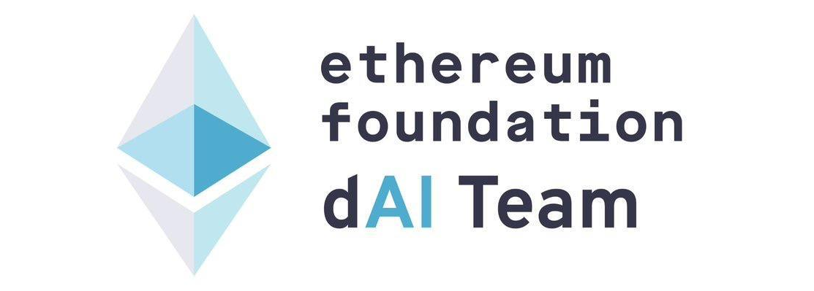

# Trustless Agents (ERC-8004) Casual Hackathon

**Decentralized and Trustless AI Agents** are reshaping the Ethereum ecosystem, with **ERC-8004** at the core.

This virtual **Casual Hackathon** runs from **Oct 27 – Nov 9**, featuring brainstorming, team matching, workshops, AMAs, an open day, and a demo day. Feel free to register in advance! Bring your ideas, code, and creativity to build the next wave of decentralized AI agents.

This is phase 2 of **“Let’s Build Trustless Agents”**, co-hosted by [LXDAO](https://x.com/LXDAO_Official) and [ETHPanda](https://x.com/ETHPanda_Org), with special support from the EF dAI team. Community -> <https://t.me/Trustless_Agents_ERC_8004_CH>

## ⏰ Program Timeline

| Event           | Time                  | Format    | Recap                |
| --------------- | --------------------- | --------- | ------------------------------ |
| **Workshop**  | TODO | Online | |
| **Open Day**  | Nov. 2, 5:30 PM UTC+8 | Online | |
| **Demo Day** | Nov. 9, 5:30 PM UTC+8 | Online | |

## 📝 Registration

<!-- Registration link start -->
[Register ➡️](https://github.com/CasualHackathon/TrustlessAgents/issues/new?title=Registration%20-%20New&body=%23%23%20Registration%20Form%0A%0A%3E%20%F0%9F%93%9D%20**Please%20fill%20in%20the%20content%20after%20%22%3E%22**%0A%0A**Name**%20(Please%20enter%20your%20full%20name%20%7C%20Required)%0A%3E%0A%0A**Description**%20(Brief%20personal%20introduction%20including%20skills%20and%20experience%20%7C%20Required)%0A%3E%0A%0A**Contact**%20(Format%3A%20Contact%20Method%3A%20Contact%20Account%2C%20e.g.%2C%20Telegram%3A%20%40username%2C%20WeChat%3A%20username%2C%20Email%3A%20email%40example.com%20%7C%20Required)%0A%3E%0A%0A**Wallet%20Address**%20(Your%20wallet%20address%20or%20ENS%20domain%20on%20Ethereum%20mainnet)%0A%3E%0A%0A**Team%20Willingness**%20(Choose%20one%3A%20Yes%20%7C%20No%20%7C%20Maybe)%0A%3E)
<!-- Registration link end -->

- Note: Please do not modify other people's information.

<!-- Registration start -->
| Name | Description | Contact | Team Willingness | Operate |
| ---- | ----------- | ------- | ---------------- | ------- |
| [Botao Amber Hu](https://botao.hu) | CS PhD in Oxford. Previously: Researcher from Summer of Protocols (Ethereum Foundation). Research Interest: [Artificial Life](https://arxiv.org/abs/2506.04236), [Decentralized AI](https://papers.ssrn.com/sol3/papers.cfm?abstract_id=5110089) and [Trustless Autonomy](https://www.arxiv.org/abs/2505.09757). | telegram: @botaohu  email: amber@reality.design (preferred) | Yes. I am a researcher and designer with theories and insights for Trustless Agent. I am looking for an engineer to help. | [Edit](https://github.com/CasualHackathon/TrustlessAgents/issues/new?title=Registration%20-%20%5BBotao%20Amber%20Hu%5D(https%3A%2F%2Fbotao.hu)&body=%23%23%20Registration%20Form%0A%0A%3E%20%F0%9F%93%9D%20**Please%20fill%20in%20the%20content%20after%20%22%3E%22**%0A%0A**Name**%20(Please%20enter%20your%20full%20name%20%7C%20Required)%0A%3E%20%5BBotao%20Amber%20Hu%5D(https%3A%2F%2Fbotao.hu)%0A%0A**Description**%20(Brief%20personal%20introduction%20including%20skills%20and%20experience%20%7C%20Required)%0A%3E%20CS%20PhD%20in%20Oxford.%20Previously%3A%20Researcher%20from%20Summer%20of%20Protocols%20(Ethereum%20Foundation).%20Research%20Interest%3A%20%5BArtificial%20Life%5D(https%3A%2F%2Farxiv.org%2Fabs%2F2506.04236)%2C%20%5BDecentralized%20AI%5D(https%3A%2F%2Fpapers.ssrn.com%2Fsol3%2Fpapers.cfm%3Fabstract_id%3D5110089)%20and%20%5BTrustless%20Autonomy%5D(https%3A%2F%2Fwww.arxiv.org%2Fabs%2F2505.09757).%20%0A%0A**Contact**%20(Format%3A%20Contact%20Method%3A%20Contact%20Account%2C%20e.g.%2C%20Telegram%3A%20%40username%2C%20WeChat%3A%20username%2C%20Email%3A%20email%40example.com%20%7C%20Required)%0A%3E%20telegram%3A%20%40botaohu%20%20email%3A%20amber%40reality.design%20(preferred)%20%0A%0A**Wallet%20Address**%20(Your%20wallet%20address%20or%20ENS%20domain%20on%20Ethereum%20mainnet)%0A%3E%20bah.eth%0A%0A**Team%20Willingness**%20(Choose%20one%3A%20Yes%20%7C%20No%20%7C%20Maybe)%0A%3E%20Yes.%20I%20am%20a%20researcher%20and%20designer%20with%20theories%20and%20insights%20for%20Trustless%20Agent.%20I%20am%20looking%20for%20an%20engineer%20to%20help.%20) |
| AN MUNING | Founder of Protocol Bank . Protocol Sign, Dchat.  ex Outliers fund | Email: everest9812@gmail.com WeChat: EverestAn Telegram: @: EverestAn | Yes | [Edit](https://github.com/CasualHackathon/TrustlessAgents/issues/new?title=Registration%20-%20AN%20MUNING&body=%23%23%20Registration%20Form%0A%0A%3E%20%F0%9F%93%9D%20**Please%20fill%20in%20the%20content%20after%20%22%3E%22**%0A%0A**Name**%20(Please%20enter%20your%20full%20name%20%7C%20Required)%0A%3E%20AN%20MUNING%0A%0A**Description**%20(Brief%20personal%20introduction%20including%20skills%20and%20experience%20%7C%20Required)%0A%3E%20Founder%20of%20Protocol%20Bank%20.%20Protocol%20Sign%2C%20Dchat.%20%20ex%20Outliers%20fund%0A%0A**Contact**%20(Format%3A%20Contact%20Method%3A%20Contact%20Account%2C%20e.g.%2C%20Telegram%3A%20%40username%2C%20WeChat%3A%20username%2C%20Email%3A%20email%40example.com%20%7C%20Required)%0A%3E%20Email%3A%20everest9812%40gmail.com%20WeChat%3A%20EverestAn%20Telegram%3A%20%40%3A%20EverestAn%0A%0A**Wallet%20Address**%20(Your%20wallet%20address%20or%20ENS%20domain%20on%20Ethereum%20mainnet)%0A%3E0x66794fC75C351ad9677cB00B2043868C11dfcadA%0A%0A**Team%20Willingness**%20(Choose%20one%3A%20Yes%20%7C%20No%20%7C%20Maybe)%0A%3E%20Yes) |
| Joy Wang | Backend engineer in industrial data platform. Exploring web3 opportunities. | Email: 727333914@qq.com WeChat: WQ-2066 Telegram: @:JoyWQQ | Yes | [Edit](https://github.com/CasualHackathon/TrustlessAgents/issues/new?title=Registration%20-%20Joy%20Wang&body=%23%23%20Registration%20Form%0A%0A%3E%20%F0%9F%93%9D%20**Please%20fill%20in%20the%20content%20after%20%22%3E%22**%0A%0A**Name**%20(Please%20enter%20your%20full%20name%20%7C%20Required)%0A%3E%20Joy%20Wang%0A%0A**Description**%20(Brief%20personal%20introduction%20including%20skills%20and%20experience%20%7C%20Required)%0A%3E%20Backend%20engineer%20in%20industrial%20data%20platform.%20Exploring%20web3%20opportunities.%0A%0A**Contact**%20(Format%3A%20Contact%20Method%3A%20Contact%20Account%2C%20e.g.%2C%20Telegram%3A%20%40username%2C%20WeChat%3A%20username%2C%20Email%3A%20email%40example.com%20%7C%20Required)%0A%3E%20Email%3A%20727333914%40qq.com%20WeChat%3A%20WQ-2066%20Telegram%3A%20%40%3AJoyWQQ%0A%0A**Wallet%20Address**%20(Your%20wallet%20address%20or%20ENS%20domain%20on%20Ethereum%20mainnet)%0A%3E0xd3066C388978d0C96372b6e85594D84cC4c37030%0A%0A**Team%20Willingness**%20(Choose%20one%3A%20Yes%20%7C%20No%20%7C%20Maybe)%0A%3E%20Yes) |
| karl4c | entry-level Dapp Developer, familiar with foundry, react, next,js | Telegram: @karl4chill , WeChat: Junghan_11 | Maybe | [Edit](https://github.com/CasualHackathon/TrustlessAgents/issues/new?title=Registration%20-%20karl4c&body=%23%23%20Registration%20Form%0A%0A%3E%20%F0%9F%93%9D%20**Please%20fill%20in%20the%20content%20after%20%22%3E%22**%0A%0A**Name**%20(Please%20enter%20your%20full%20name%20%7C%20Required)%0A%3Ekarl4c%0A%0A**Description**%20(Brief%20personal%20introduction%20including%20skills%20and%20experience%20%7C%20Required)%0A%3Eentry-level%20Dapp%20Developer%2C%20familiar%20with%20foundry%2C%20react%2C%20next%2Cjs%0A%0A**Contact**%20(Format%3A%20Contact%20Method%3A%20Contact%20Account%2C%20e.g.%2C%20Telegram%3A%20%40username%2C%20WeChat%3A%20username%2C%20Email%3A%20email%40example.com%20%7C%20Required)%0A%3ETelegram%3A%20%40karl4chill%20%2C%20WeChat%3A%20Junghan_11%0A%0A**Wallet%20Address**%20(Your%20wallet%20address%20or%20ENS%20domain%20on%20Ethereum%20mainnet)%0A%3Ekarl4c.eth%0A%0A**Team%20Willingness**%20(Choose%20one%3A%20Yes%20%7C%20No%20%7C%20Maybe)%0A%3EMaybe) |
| Kogoro Kudo | Smart contract developer with experience building DeFi apps | Telegram:  @mouri4599 | No | [Edit](https://github.com/CasualHackathon/TrustlessAgents/issues/new?title=Registration%20-%20Kogoro%20Kudo&body=%23%23%20Registration%20Form%0A%0A%3E%20%F0%9F%93%9D%20**Please%20fill%20in%20the%20content%20after%20%22%3E%22**%0A%0A**Name**%20(Please%20enter%20your%20full%20name%20%7C%20Required)%0A%3E%20Kogoro%20Kudo%0A%0A**Description**%20(Brief%20personal%20introduction%20including%20skills%20and%20experience%20%7C%20Required)%0A%3E%20Smart%20contract%20developer%20with%20experience%20building%20DeFi%20apps%0A%0A**Contact**%20(Format%3A%20Contact%20Method%3A%20Contact%20Account%2C%20e.g.%2C%20Telegram%3A%20%40username%2C%20WeChat%3A%20username%2C%20Email%3A%20email%40example.com%20%7C%20Required)%0A%3E%20Telegram%3A%20%20%40mouri4599%0A%0A**Wallet%20Address**%20(Your%20wallet%20address%20or%20ENS%20domain%20on%20Ethereum%20mainnet)%0A%3E%200x18dBCE2a3A9c15c508C7dE589b8CD15493919B96%0A%0A**Team%20Willingness**%20(Choose%20one%3A%20Yes%20%7C%20No%20%7C%20Maybe)%0A%3E%20No) |
| Neo Sun | 10y+ blockchain and cryptography developer. Good at Rust, Python, Solidity, Flutter and so on. More view [neosun.me](https://neosun.me) | GitHub / Telegram / WeChat / X: @sunhuachuang, Email: hi@neosun.me | Maybe | [Edit](https://github.com/CasualHackathon/TrustlessAgents/issues/new?title=Registration%20-%20Neo%20Sun&body=%23%23%20Registration%20Form%0A%0A%3E%20%F0%9F%93%9D%20**Please%20fill%20in%20the%20content%20after%20%22%3E%22**%0A%0A**Name**%20(Please%20enter%20your%20full%20name%20%7C%20Required)%0A%3E%20Neo%20Sun%0A%0A**Description**%20(Brief%20personal%20introduction%20including%20skills%20and%20experience%20%7C%20Required)%0A%3E%2010y%2B%20blockchain%20and%20cryptography%20developer.%20Good%20at%20Rust%2C%20Python%2C%20Solidity%2C%20Flutter%20and%20so%20on.%20More%20view%20%5Bneosun.me%5D(https%3A%2F%2Fneosun.me)%0A%0A**Contact**%20(Format%3A%20Contact%20Method%3A%20Contact%20Account%2C%20e.g.%2C%20Telegram%3A%20%40username%2C%20WeChat%3A%20username%2C%20Email%3A%20email%40example.com%20%7C%20Required)%0A%3E%20GitHub%20%2F%20Telegram%20%2F%20WeChat%20%2F%20X%3A%20%40sunhuachuang%2C%20Email%3A%20hi%40neosun.me%0A%0A**Wallet%20Address**%20(Your%20wallet%20address%20or%20ENS%20domain%20on%20Ethereum%20mainnet)%0A%3E%20%20cymple.eth%0A%0A**Team%20Willingness**%20(Choose%20one%3A%20Yes%20%7C%20No%20%7C%20Maybe)%0A%3E%20Maybe) |
| Root | Data Engineer focused on on-chain data, The Graph, dashboards, and protocol analytics. Love collaborating and shipping cool stuff. | telegram: @Abthelhak, x: @Abthelhaks | Yes | [Edit](https://github.com/CasualHackathon/TrustlessAgents/issues/new?title=Registration%20-%20Root&body=**Name**%20%20%0ARoot%0A%0A**Description**%20%20%0AData%20Engineer%20focused%20on%20on-chain%20data%2C%20The%20Graph%2C%20dashboards%2C%20and%20protocol%20analytics.%20Love%20collaborating%20and%20shipping%20cool%20stuff.%0A%0A**Contact**%20%20%0Atelegram%3A%20%40Abthelhak%2C%20x%3A%20%40Abthelhaks%0A%0A**Wallet%20Address**%20%20%0A%3CYOUR_WALLET_OR_ENS_HERE%3E%0A%0A**Team%20Willingness**%20%20%0AYes) |
| xfajarr | A web3 developer who focuses on smart contracts, currently building on EVM and Sui. | Telegram: @xfajarrr | Maybe | [Edit](https://github.com/CasualHackathon/TrustlessAgents/issues/new?title=Registration%20-%20xfajarr&body=%23%23%20Registration%20Form%0A%0A%3E%20%F0%9F%93%9D%20**Please%20fill%20in%20the%20content%20after%20%22%3E%22**%0A%0A**Name**%20(Please%20enter%20your%20full%20name%20%7C%20Required)%0A%3E%20xfajarr%0A%0A**Description**%20(Brief%20personal%20introduction%20including%20skills%20and%20experience%20%7C%20Required)%0A%3E%20A%20web3%20developer%20who%20focuses%20on%20smart%20contracts%2C%20currently%20building%20on%20EVM%20and%20Sui.%0A%0A**Contact**%20(Format%3A%20Contact%20Method%3A%20Contact%20Account%2C%20e.g.%2C%20Telegram%3A%20%40username%2C%20WeChat%3A%20username%2C%20Email%3A%20email%40example.com%20%7C%20Required)%0A%3E%20Telegram%3A%20%40xfajarrr%0A%0A**Wallet%20Address**%20(Your%20wallet%20address%20or%20ENS%20domain%20on%20Ethereum%20mainnet)%0A%3E%20xfajarr.eth%0A%0A**Team%20Willingness**%20(Choose%20one%3A%20Yes%20%7C%20No%20%7C%20Maybe)%0A%3E%20Maybe) |

<!-- Registration end -->

## 🎯 Submission

<!-- Submission link start -->

[Submit ➡️](https://github.com/CasualHackathon/TrustlessAgents/issues/new?title=Submission%20-%20New&body=%23%23%20Project%20Submission%20Form%0A%0A%3E%20%F0%9F%93%9D%20**Please%20fill%20in%20the%20content%20after%20%22%3E%22**%0A%0A**Project%20Name**%20(Enter%20your%20project%20name%20%7C%20Required)%0A%3E%0A%0A**Project%20Description**%20(Brief%20description%20about%20your%20project%20in%20one%20sentence%20%7C%20Required)%0A%3E%0A%0A**Project%20Leader**%20(Project%20leader%20name%20%7C%20Required)%0A%3E%0A%0A**Project%20Members**%20(List%20all%20team%20members%2C%20comma-separated)%0A%3E%0A%0A**Repository%20URL**%20(Open%20source%20repository%20URL%20-%20project%20must%20be%20open%20source)%0A%3E%0A%0A**Team%20Members%20Wallet**%20(List%20all%20team%20members%20wallet%2C%20comma-separated%20e.g.%2C%20Alice%3A0x12345...%20%2C%20Bob%3A0x12345...)%0A%3E)

<!-- Submission link end -->

- Complete registration before submitting.
- Note: Please do not modify other people's information.

<!-- Submission start -->
| Project | Description | Members | Leader | Repository | Operate |
| ----------- | ----------------- | -------------- | ------- | ---------- | -------- |

<!-- Submission end -->

## ⏰ Program Timeline

- **Casual Hackathon**: Oct 27 – Nov 9. Hands-on implementation and creative exploration
- **Demo Day**: Nov 9, 2025. Time TBD. Submit on GitHub, live show, fun prizes

Stay up to date by joining Telegram group: <https://t.me/Trustless_Agents_ERC_8004_CH>.

## 👨‍💻 Who Should Join?

This isn't a bootcamp for beginners — it's a high-bar, low-ego program designed for:

- **AI Agent & Ethereum Developers**: Expanding Ethereum's capabilities into decentralized AI
- **AI/ML Engineers & Researchers**: Building trustless, verifiable, and autonomous AI agents
- **Web3 Product Managers**: Exploring next-gen AI × ETH dApps and A2A architectures
- **AI Startups**: Share projects and insights with the community and foundations — and connect with peers
- **Motivated Learners**: Dive into the frontier of AI × ETH

If you’re ready to:

* Dive into **ERC-8004** and build MVPs around it.
* Turn ideas into working code using the latest Ethereum features.
* Have fun and create something cool.

**This hackathon is for you.**

## 🎁 Awards and Prizes

- The greatest reward is the knowledge you gain — and the chance to meet like-minded builders through their shared notes.
- Outstanding builders may be invited to demo on stage at **Devconnect Trustless Agent Day on Nov 21**.
- More benefits will be announced with partners!

### 🚀 Project Examples

- **ERC-8004 Trustless Agents Example**: [GitHub Repository](https://github.com/vistara-apps/erc-8004-example)
- **Arena SDK**: With 8004 identities + A2A + ChaosChain integration for receipt logged on-chain and payment released on verification. [GitHub Repository](https://github.com/vistara-apps/agent-arena-v1)

Welcome to propose more ideas and examples!

## 🧩 Why ERC-8004? Why Now?

**ERC-8004** addresses key limitations of traditional AI agent systems while preserving their core strength: enabling trustless, verifiable, and economically autonomous AI agents.

Key benefits:

- ✅ **Decentralized Identity** (works with existing Ethereum infrastructure)
- ✅ **Highly extensible** (supports custom validation logic and reputation systems)
- ✅ **Improved security model** (avoids centralized control and single points of failure)

This isn't just a fix — it's a new design space for AI agents, dApps, security, identity, and permissions.

**Now** is the time to build, test, question, and innovate — hands-on, from the ground up.

## 🛠 Highlights

✨ **Tech Talks**

- Deep dives into ERC-8004
- Evolution of Decentralized AI Agents
- Modular agent architecture trends

💬 **Online Learning Space**

- Small, high-signal discussion groups
- Shared collab code zones
- Global devs co-building across time zones

🧑‍⚖️ **Expert Mentors**

- Ethereum core devs / researchers
- AI/ML experts, security researchers

TODO WIP

**🌟 Guests**

TODO WIP

## 📚 Resources

- [Idea](./docs/idea.md)
- [Articles](./docs/articles.md)
- [Examples](./docs/examples/README.md)

### Additional Resources

- [Trustless Agents (ERC-8004) Intensive Co-Learning](https://intensivecolearn.ing/en/programs/trustless-agents)
- [ERC-8004 EIP](https://eips.ethereum.org/EIPS/eip-8004)
- [ERC-8004 Discussion](https://ethereum-magicians.org/t/erc-8004-trustless-agents/25098)
- [A2A Protocol](https://a2a-protocol.org/latest/)
- [x402 Protocol](https://x402.gitbook.io/x402)
- [ERC-8004 QA Bot](https://chatgpt.com/g/g-68da14310f6c81918d088bd729edefce-erc-8004-qa)
- [A2A GitHub](https://github.com/a2aproject/A2A)
- [x402 Whitepaper](https://www.x402.org/x402-whitepaper.pdf)
- [Awesome A2A Agents](https://github.com/isekOS/awesome-a2a-agents)

## 🤝 Co-organizers

<table>
    <tr>
         <td  align="center" valign="middle">
            
        </td>
        <td  align="center" valign="middle">
            
        </td>
    </tr>
</table>

## 🤝 Special Supporter

<table>
    <tr>
        <td align="center" valign="middle">
            
        </td>
    </tr>
</table>

## 💰 Sponsors

<table>
    <tr>
        <td align="center" valign="middle">
            
        </td>
        <td align="center" valign="middle">
            
        </td>
    </tr>
</table>

## 🌟 Community Supporters

<table>
    <tr>
        <td align="center" valign="middle">
            
        </td>
        <td align="center" valign="middle">
            
        </td>
    </tr>
</table>

## 🎯 Seeking More Partnerships

More sponsors and supporters are on the way! If you wish to support, please dm [@brucexu_eth](https://t.me/brucexu_eth). We welcome all forms of sponsorship and partnership!

## 🌿 What is Casual Hackathon?

Low-cost, casual hackathons that let anyone revel in the pure joy of creating — and spark real innovation in return. Casual Hackathon is an open-source public good initated by [LXDAO](https://forum.lxdao.io/t/the-introduction-of-casual-hackathon/2827).

### ✨ Core Principles

- **Lightweight operation**: Online-first, casual participation, no pressure — extremely low operational overhead.
- **Open-source public good**: Fully open-source with no patent restrictions; any group can adopt or fork it.
- **De-commercialized**: No mandatory prize pools or sponsor KPIs — bounty hunters stay away, creativity comes first.
- **Relaxed participation**: No forced all-nighters or on-site attendance; health and enjoyment matter.
- **Everyone wins**: Mentors present a unique award to every project, giving all ideas their moment.
- **Curated themes**: Carefully curated prompts that spark imagination and encourage playful, cutting-edge development

---
Have fun!
